## Inheritance

Contracts Inheritance diagram, for better code understanding and maintainability

<p align="center">
  
</p><br>

```txt
graph TD;
    ERC20Basic-->BasicToken;
    BasicToken-->BurnableToken;
    MintableToken-->CappedToken;
    ERC20-->DetailedERC20;
    ERC20Basic-->ERC20;
    StandardToken-->MintableToken;
    Ownable-->MintableToken;
    StandardToken-->PausableToken;
    Pausable-->PausableToken;
    MintableToken-->RBACMintableToken;
    RBAC-->RBACMintableToken;
    BurnableToken-->StandardBurnableToken;
    StandardToken-->StandardBurnableToken;
    Ownable-->TokenVesting;
    SaferERC20;
    TokenTimelock;
```